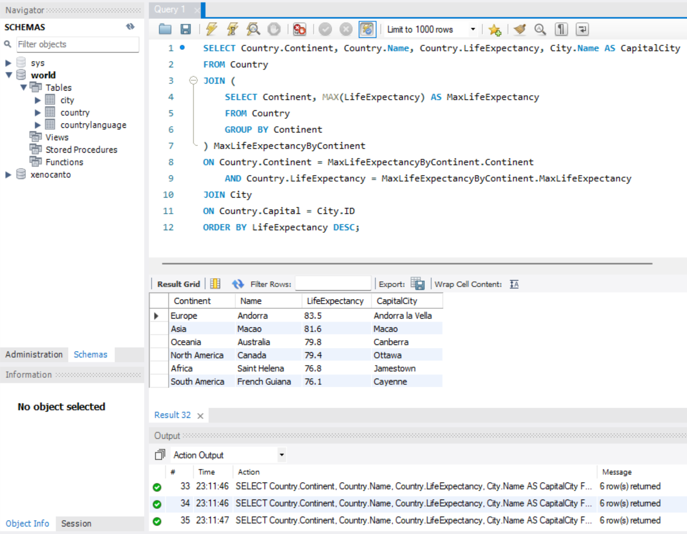

# Week 6 Mini-Poject

[](https://github.com/nogibjj/week6-miniproject/actions/workflows/python-ci.yml)

#### Requirements:
 - Design a complex SQL query involving joins, aggregation, and sorting
 - Provide an explanation for what the query is doing and the expected results

## Project Walkthrough

### MySQL Database
This project utilizes the public [world database](https://dev.mysql.com/doc/index-other.html) provided by MySQL.

#### Creating the tables
The tables were created using the MySQL cli.


#### Analyzing the data
The `city`, `country`, and `countrylanguage` tables had the following columns:


### Complex Query

The following query finds the country in each continent with the maximum Life Expectancy. It returns the Continent, Country Name, and Life Expectancy in descending order.
```sql
SELECT
    Country.Continent,
    Country.Name,
    Country.LifeExpectancy
FROM 
    Country
JOIN 
    (
        SELECT 
            Continent,
            MAX(LifeExpectancy) AS MaxLifeExpectancy
        FROM 
            Country
        GROUP BY 
            Continent
    ) MaxLifeExpectancyByContinent
ON 
    Country.Continent = MaxLifeExpectancyByContinent.Continent
    AND Country.LifeExpectancy = MaxLifeExpectancyByContinent.MaxLifeExpectancy
ORDER BY LifeExpectancy DESC;
```
### Query Explanation 
1. `SELECT Country.Continent, Country.Name, Country.LifeExpectancy`

      We are selecting the continent, country name, and life expectancy from the "Country" table.

2. `FROM Country`

      We are specifying that we're working with the "Country" table.

3. ```JOIN (...) MaxLifeExpectancyByContinent ON Country.Continent = MaxLifeExpectancyByContinent.Continent AND Country LifeExpectancy = MaxLifeExpectancyByContinent.MaxLifeExpectancy```

      We're performing a join operation. The subquery in parentheses calculates the maximum life expectancy for each continent. Then, we're joining the main "Country" table with this subquery based on matching continents and life expectancies to get the countries with the highest life expectancy in each continent.
    
4. ```SELECT Continent, MAX(LifeExpectancy) AS MaxLifeExpectancy FROM Country GROUP BY Continent```

      This subquery calculates the maximum life expectancy for each continent in the "Country" table. It uses the aggregation function MAX() to calculate this maximum value.

5. ```ON Country.Continent = MaxLifeExpectancyByContinent.Continent AND Country.LifeExpectancy = MaxLifeExpectancyByContinent.MaxLifeExpectancy```

      This specifies the conditions for the join, ensuring that we're matching countries with the highest life expectancy in their respective continents.

6. ```ORDER BY LifeExpectancy DESC;```

      This sorts the final outcome by LifeExpectancy in descending order.

### Query Results
The query shows that the countries from each continent with the highest life expectancy are as follows:

| Continent      | Name          | LifeExpectancy |
|--------------- |-------------- |-------------- |
| Europe         | Andorra       | 83.5          |
| Asia           | Macao         | 81.6          |
| Oceania        | Australia     | 79.8          |
| North America  | Canada        | 79.4          |
| Africa         | Saint Helena  | 76.8          |
| South America  | French Guiana | 76.1          |


